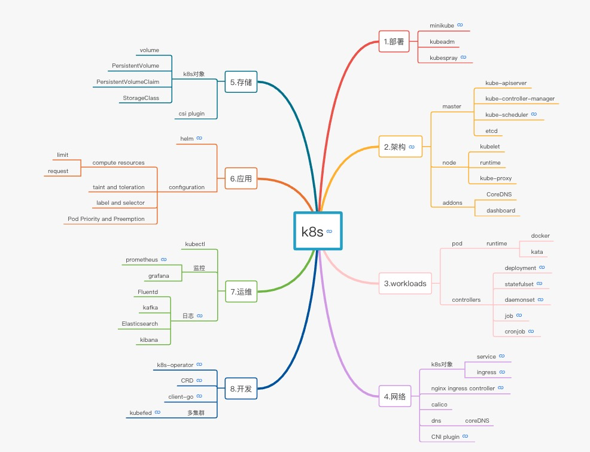
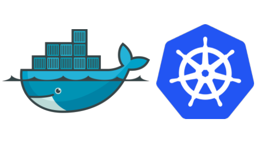
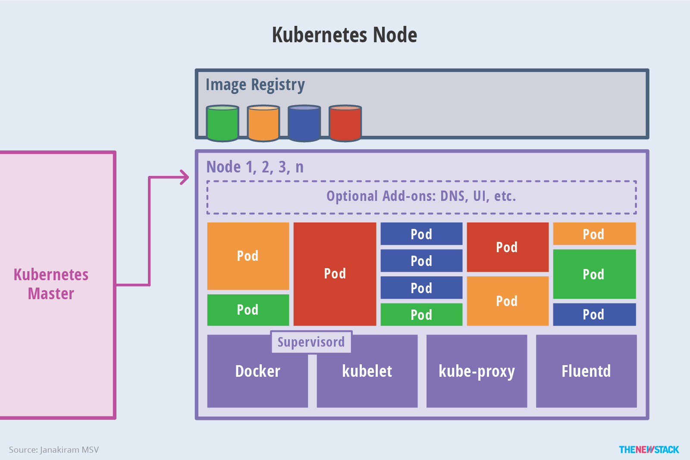

# Kubernetes分享

<!-- GFM-TOC -->
 * [前言](#前言)
 * [初识k8s](#初识k8s)
 * [架构](#架构) 
 * [资源对象](#资源对象)
 * [常用命令](#常用命令)
<!-- GFM-TOC -->
## 前言
&emsp;&emsp;随着容器技术的发展，Docker近几年突然崛起，变得炙手可热，已经成为容器技术的事实标准。然而想要在生成环境中成功部署和操作容器的关键是容器编排技术，市场上有各种各样的容器编排工具（如Docker原生的Swarm），其中谷歌公司开发的Kubernetes得到开源社区的全力支持，IBM、惠普、微软、RedHat等业界巨头纷纷加入，Kubernetes已经成为GitHub上的明星开源项目。
<br/>
[CKA认证](https://www.bilibili.com/video/BV1S7411m7vM?p=1)
<div align=center></div>


## 初识k8s
&emsp;&emsp;[Kubernetes](https://kubernetes.io/) 这个名字源于希腊语，是舵手的意思，所以它的Logo既像一张渔网，又像一个罗盘。有意思的是Docker的Logo为驮着集装箱在大海上遨游的鲸鱼，Kubernetes与Docker的关系可见一斑。

<div align=center></div>
<br/>
&emsp;&emsp;Kubernetes（也常称K8s，用8代替8个字符“ubernete”而成的缩写。）是一个全新的基于容器技术的分布式架构方案，它源自Google内部大规模集群管理系统——Borg，也是CNCF（Cloud Native Computing Foundation，今属Linux基金会）最重要的项目之一，旨在让部署容器化的应用简单并且高效。 

&emsp;&emsp;Kubernetes 具备完善的集群管理能力，包括多层次的安全防护和准入机制、多租户应用支撑能力、透明的服务注册和服务发现机制、内建负载均衡器、故障发现和自我修复能力、服务滚动升级和在线扩容、可扩展的资源自动调度机制、多粒度的资源配额管理能力。还提供完善的管理工具，涵盖开发、部署测试、运维监控等各个环节。

## 安装
- [kubeadm](https://kubernetes.io/docs/setup/production-environment/tools/kubeadm/install-kubeadm/)
- [kubespray](https://github.com/kubernetes-sigs/kubespray)

## 架构
&emsp;&emsp;Kubernetes使用Go语言开发，集群采用 Master/Node（最初称为Minion，后改名Node） 的结构，Master（主节点）控制整个集群，Node（从节点）为集群提供计算能力。用户可以通过命令行或者Web页面的方式来操作集群。


<br>
<div align=center></div>

&emsp;&emsp;Master是Kubernetes集群的大脑，负责公开集群的API，调度部署和管理整个集群。集群至少有一个Master节点，如果在生产环境中要达到高可用，还需要配置Master集群。Master主要包含API Server、Scheduler、Controller三个组件，需要etcd组件来保存整个集群的状态。

- etcd：由CoreOS开发，是一个高可用、强一致性的服务发现存储仓库，为Kubernetes集群提供存储服务，类似于zookeper。

- API Server： kubernetes最重要的核心组件之一，提供资源操作的唯一入口（其他模块通过API Server查询或修改数据，只有API Server才直接操作etcd），并提供认证、授权、访问控制、API注册和发现等机制。

- Scheduler：负责资源的调度，按照预定的调度策略将Pod（k8s中调度的基本单位）调度到相应的Node上。

- Controller：通过API Server来监控整个集群的状态，并确保集群处于预期的工作状态，比如故障检测、自动扩展、滚动更新等。

<br>
<div align=center></div>

&emsp;&emsp;Node是Kubernetes集群的工作节点，可以是物理机也可以是虚拟机。Node需要包含容器、kubelet、kube-proxy等组件。Fluentd用来提供日志收集功能（可选）。

- kubelet：维护容器的生命周期，同时也负责Volume（CVI）和网络（CNI）的管理。每个节点上都会运行一个kubelet服务进程，接收并执行Master发来的指令，管理Pod及Pod中的容器。每个kubelet进程会在API Server上注册节点自身信息，定期向Master节点汇报节点的资源使用情况，并通过cAdvisor监控节点和容器的资源。

- kube-proxy： 为 Service 提供集群内部的服务发现和负载均衡，监听 API Server 中 service和endpoint的变化情况，并通过iptables等方式来为服务配置负载均衡。

- pause: 在pod中担任Linux命名空间共享的基础,启用pid命名空间，开启init进程。

- Docker： 每台Node上需要安装Docker来运行镜像，但是Docker不是唯一选择，Kubernetes支持多种容器，比如CoreOS公司的Rkt容器（之前称为Rocket，现更名为Rkt）。

<br>
<div align=center></div>

## 资源对象

&emsp;&emsp;API对象是Kubernetes集群中的管理操作单元。集群中的众多技术概念分别对应着API对象，每个API对象都有3大类属性：

- metadata（元数据）：用来标识API对象，包含namespace、name、uid等。

- spec （规范）：描述用户期望达到的理想状态，所有的操作都是声明式（Declarative）的而不是命令式（Imperative），在分布式系统中的好处是稳定，不怕丢操作或运行多次。比如设置期望3个运行Nginx的pod，运行多次也还是一个结果，而给副本数加1的操作就不是声明式的，运行多次结果就错了。

- status（状态）：描述系统当前实际达到的状态，比如期望3个pod，现在实际创建好了2个。


<br>

&emsp;&emsp;在Kubernetes众多的API对象中，Pod是最重要的也是最基础的，是kubernetes中可以创建的最小部署单元。Pod就像是豌豆荚一样，它可以由一个或者多个容器组成，这些容器共享存储、网络和配置项。

&emsp;&emsp;目前Kubernetes中的业务类型可以分为长期伺服型（long-running）、批处理型（batch）、节点后台支撑型（node-daemon）和有状态应用型（stateful application）这四种类型，而这四种类型的业务又可以由不同类型的Pod控制器来完成，分别为：Deployment、Job、DaemonSet和StatefulSet。

- Deployment： 复制控制器（Replication Controller，RC）是集群中最早的保证Pod高可用的API对象，副本集（Replica Set，RS）是它的升级，能支持更多种类的匹配模式。部署(Deployment)又是比RS应用模式更广的API对象，以Kubernetes的发展方向，未来对所有长期伺服型的的业务的管理，都会通过Deployment来管理。

- Service： Deployment保证了Pod的数量，但是没有解决如何访问Pod的问题，一个Pod只是一个运行服务的实例，随时可能在一个节点上停止，在另一个节点以一个新的IP启动一个新的Pod，因此不能以确定的IP和端口号提供服务。要稳定地提供服务需要服务发现和负载均衡能力，Service可以稳定为用户提供服务。

- Job： 用来控制批处理型任务，Job管理的Pod根据用户的设置把任务成功完成就自动退出了。

- DaemonSet： 后台支撑型服务的核心关注点在集群中的Node，要保证每个Node上都有一个此类Pod运行。比如用来收集日志的Pod。

- StatefulSet： 不同于RC和RS，StatefulSet主要提供有状态的服务，StatefulSet中Pod的名字都是事先确定的，不能更改，每个Pod挂载自己独立的存储，如果一个Pod出现故障，从其他节点启动一个同样名字的Pod，要挂载上原来Pod的存储继续以它的状态提供服务。比如数据库服务MySQL，我们不希望一个Pod故障后，MySQL中的数据即丢失。

## 存储

1.volume概述

- 容器上的文件生命周期同容器的生命周期一致，即容器挂掉之后，容器将会以最初镜像中的文件系统内容启动，之前容器运行时产生的文件将会丢失。
- Pod的volume的生命周期同Pod的生命周期一致，当Pod被删除的时候，对应的volume才会被删除。即Pod中的容器重启时，之前的文件仍可以保存。

2.volume类型

- emptyDir

   a. 特点
   
   - 会创建emptyDir对应的目录，默认为空（如果该目录原来有文件也会被重置为空）
   - Pod中的不同容器可以在目录中读写相同文件（即Pod中的不同容器可以通过该方式来共享文件）
   - 当Pod被删除，emptyDir 中的数据将被永久删除，如果只是Pod挂掉该数据还会保留
   
   b. 使用场景
   - 不同容器之间共享文件（例如日志采集等）
   - 暂存空间，例如用于基于磁盘的合并排序
   - 用作长时间计算崩溃恢复时的检查点
   
- hostPath

   a. 特点
   - 会将宿主机的目录或文件挂载到Pod中
   
   b. 使用场景
   - 运行需要访问 Docker 内部的容器；使用 /var/lib/docker 的 hostPath
   - 在容器中运行 cAdvisor；使用 /dev/cgroups 的 hostPath
   - 其他使用到宿主机文件的场景

- configMap

   configMap提供了一种给Pod注入配置文件的方式，配置文件内容存储在configMap对象中，如果Pod使用configMap作为volume的类型，需要先创建configMap的对象。
   
- cephfs

   cephfs的方式将Pod的存储挂载到ceph集群中，通过外部存储的方式持久化Pod的数据（即当Pod被删除数据仍可以存储在ceph集群中），前提是先部署和维护好一个ceph集群。
   
- nfs

   nfs的方式类似cephfs，即将Pod数据存储到NFS集群中

- persistentVolumeClaim
   
   persistentVolumeClaim 卷用于将PersistentVolume挂载到容器中。PersistentVolumes 是在用户不知道特定云环境的细节的情况下“声明”持久化存储（例如 GCE PersistentDisk 或 iSCSI 卷）的一种方式。
   


3.PersistentVolume

- PV概述
PersistentVolume（简称PV） 是 Volume 之类的卷插件，也是集群中的资源，但独立于Pod的生命周期（即不会因Pod删除而被删除），不归属于某个Namespace。

- PV和PVC的生命周期

   - 配置
   
   有两种方式来配置 PV：静态或动态。
   
   a. 静态
   
   手动创建PV，可供k8s集群中的对象消费。
   
   b. 动态
   
   可以通过StorageClass和具体的Provisioner（例如nfs-client-provisioner）来动态地创建和删除PV。
   
   - 绑定
   
   在动态配置的情况下，用户创建了特定的PVC，k8s会监听新的PVC，并寻找匹配的PV绑定。一旦绑定后，这种绑定是排他性的，PVC和PV的绑定是一对一的映射。
   
   - 使用
   
   Pod 使用PVC作为卷。集群检查PVC以查找绑定的卷并为集群挂载该卷。用户通过在 Pod 的 volume 配置中包含 persistentVolumeClaim 来调度 Pod 并访问用户声明的 PV。
   
   - 回收
   
   PV的回收策略可以设定PVC在释放后如何处理对应的Volume，目前有 Retained， Recycled和Deleted三种策略。
   
   a. 保留（Retain）
   
   保留策略允许手动回收资源，当删除PVC的时候，PV仍然存在，可以通过以下步骤回收卷：
   
      - 删除PV
      - 手动清理外部存储的数据资源
      - 手动删除或重新使用关联的存储资产
   
   b. 回收（Resycle）
   
   >该策略已废弃，推荐使用dynamic provisioning
      
   回收策略会在 volume上执行基本擦除（rm -rf / thevolume / *），可被再次声明使用。
   
   c. 删除（Delete）
   
   删除策略，当发生删除操作的时候，会从k8s集群中删除PV对象，并执行外部存储资源的删除操作（根据不同的provisioner定义的删除逻辑不同，有的是重命名）。
   
   动态配置的卷继承其StorageClass的回收策略，默认为Delete，即当用户删除PVC的时候，会自动执行PV的删除策略。
   
   - PV的类型
   
      - GCEPersistentDisk
      - AWSElasticBlockStore
      - NFS
      - RBD (Ceph Block Device)
      - CephFS
      - Glusterfs

   - Access Modes
   
   不同类型Volume插件支持不同 [详细点击](https://kubernetes.io/docs/concepts/storage/persistent-volumes/)
   
      - ReadWriteOnce——该卷可以被单个节点以读/写模式挂载
      - ReadOnlyMany——该卷可以被多个节点以只读模式挂载
      - ReadWriteMany——该卷可以被多个节点以读/写模式挂载

   >一个卷一次只能使用一种访问模式挂载，即使它支持很多访问模式。
    
   - Class
   
   PV可以指定一个StorageClass来动态绑定PV和PVC，其中通过 storageClassName 属性来指定具体的StorageClass，如果没有指定该属性的PV，它只能绑定到不需要特定类的 PVC。
   
   - Phase
   
      - Available（可用）——一块空闲资源还没有被任何声明绑定
      - Bound（已绑定）——卷已经被声明绑定
      - Released（已释放）——声明被删除，但是资源还未被集群重新声明
      - Failed（失败）——该卷的自动回收失败


4.PersistentVolumeClaim

- PVC概述

PersistentVolumeClaim（简称PVC）是用户存储的请求，PVC消耗PV的资源，可以请求特定的大小和访问模式，需要指定归属于某个Namespace，在同一个Namespace的Pod才可以指定对应的PVC。

当需要不同性质的PV来满足存储需求时，可以使用StorageClass来实现。

   
5.StorageClass

- StorageClass概述

StorageClass提供了一种描述存储类（class）的方法，不同的class可能会映射到不同的服务质量等级和备份策略或其他策略等。

StorageClass 对象中包含 provisioner、parameters 和 reclaimPolicy 字段，当需要动态分配 PersistentVolume 时会使用到。当创建 StorageClass 对象时，设置名称和其他参数，一旦创建了对象就不能再对其更新。也可以为没有申请绑定到特定 class 的 PVC 指定一个默认的 StorageClass 。

   - Provisioner
   
   Storage class 有一个分配器（provisioner），用来决定使用哪个卷插件分配 PV，该字段必须指定。可以指定内部分配器，也可以指定外部分配器。外部分配器的代码地址为： [kubernetes-incubator/external-storage](https://github.com/kubernetes-retired/external-storage)，其中包括NFS和Ceph等。
   
   - Reclaim Policy（回收策略）
   
   可以通过reclaimPolicy字段指定创建的Persistent Volume的回收策略，回收策略包括：Delete 或者 Retain，没有指定默认为Delete。
   
6.Dynamic Volume Provisioning

Dynamic volume provisioning允许用户按需自动创建存储卷，这种方式可以让用户不需要关心存储的复杂性和差别，又可以选择不同的存储类型。

- 开启Dynamic Provisioning

需要先提前创建StorageClass对象，StorageClass中定义了使用哪个provisioner，并且在provisioner被调用时传入哪些参数，具体可参考StorageClass

- 使用Dynamic Provisioning

```yaml
apiVersion: v1
kind: PersistentVolumeClaim
metadata:
  name: claim1
spec:
  accessModes:
    - ReadWriteOnce
  storageClassName: fast
  resources:
    requests:
      storage: 30Gi
```


## 常用命令

- 自动补全
```shell script
# 安装bash-completion
yum install -y epel-release.noarch
yum install -y bash_completion
# 添加补全脚本
kubectl completion bash >/etc/bash_completion.d/kubectl
```
其他系统[Install and Set Up kubectl](https://kubernetes.io/docs/tasks/tools/install-kubectl/)

- 查看资源对象
```shell script
# Usage:
kubectl explain RESOURCE [options]
```

- 声明式资源对象管理
```shell script
# Usage:
kubectl apply (-f FILENAME | -k DIRECTORY) [options]
```

- 创建资源
```shell script
kubectl create deployment my-dep --image=busybox        # 创建一个deplpyme
kubectl expose rc nginx --port=80 --target-port=8000    # 创建一个svc，暴露 nginx 这个rc
```

- 更新资源
```shell script
kubectl scale --replicas=3 -f foo.yaml                                     # 将foo.yaml中描述的对象扩展为3个
kubectl annotate pods foo description='my frontend'                        # 增加description='my frontend'备注,已有保留不覆盖
kubectl label --overwrite pods foo status=unhealthy                        # 增加status=unhealthy 标签，已有则覆盖
kubectl rollout history deployment/nginx-deployment                        # 检查 Deployment 修订历史
kubectl rollout history deployment/nginx-deployment --revision=2           # 查看修订历史的详细信
kubectl rollout undo deployment/nginx-deployment                           # 回滚到之前的修订版本 
kubectl rollout undo deployment.v1.apps/nginx-deployment --to-revision=2   #通过使用 --to-revision 来回滚到特定修订版本
```

- 删除资源
```shell script
kubectl delete -f xxx.yaml                      # 删除一个配置文件对应的资源对象  
kubectl delete pod,service baz foo              # 删除名字为baz或foo的pod和service  
kubectl delete pods,services -l name=myLabel    # -l 参数可以删除包含指定label的资源对象                            
kubectl delete pod foo --grace-period=0 --force # 强制删除一个pod，在各种原因pod一直terminate不掉的时候很有用
```

- 查看资源状态
```shell script
kubectl get
[(-o|--output=)](TYPE[.VERSION][.GROUP] [NAME | -l label] | TYPE[.VERSION][.GROUP]/NAME ...) [flags] 
[options]
# Examples: 
kubectl get services                          # 列出当前NS中所有service资源
kubectl get pods --all-namespaces             # 列出集群所有NS中所有的Pod
kubectl get pods -o wide                      # -o wide也比较常用，可以显示更多资源信息，比如pod的IP等
kubectl get deployment my-dep                 # 可以直接指定资源名查看
kubectl get deployment my-dep --watch         # --watch 参数可以监控资源的状态，在状态变换时输出。在跟踪服务部署情况时很有用
kubectl get pod my-pod -o yaml                # 查看yaml格式的资源配置，这里包括资实际的status，可以用--export排除
kubectl get pod my-pod -l app=nginx           # 查看所有带有标签app: nginx的pod
```
- 查看资源信息
```shell script
# Usage:
kubectl describe (-f FILENAME | TYPE [NAME_PREFIX | -l label] | TYPE/NAME) [options]
# Examples: 
kubectl describe nodes my-node    # 查看节点my-node的详细信息
kubectl describe pods my-pod      # 查看pod my-pod的详细信息
```

- 日志查看
```shell script
# Usage:
kubectl logs [-f] [-p] (POD | TYPE/NAME) [-c CONTAINER] [options]
# Examples: 
kubectl logs my-pod                              
# 输出一个单容器pod my-pod的日志到标准输出
kubectl logs nginx-78f5d695bd-czm8z -c nginx     
# 输出多容器pod中的某个nginx容器的日志
kubectl logs -l app=nginx                        
# 输出所有包含app-nginx标签的pod日志
kubectl logs -f my-pod                           
# 加上-f参数跟踪日志，类似tail -f
kubectl logs my-pod  -p                          
# 输出该pod的上一个退出的容器实例日志。在pod容器异常退出时很有用
kubectl logs my-pod  --since-time=2018-11-01T15:00:00Z
# 指定时间戳输出日志            
kubectl logs my-pod  --since=1h 
# 指定时间段输出日志，单位s/m/h
```

- 执行命令
```shell script
# 命令作用和参数基本与docker exec一致
# Usage:
kubectl exec POD [-c CONTAINER] -- COMMAND [args...] [options]
# Examples:
kubectl exec my-pod ls                         # 对my-pod执行ls命令
kubectl exec -t -i nginx-78f5d695bd-czm8z bash # 进入pod的shell，并打开伪终端和标准输入
```

- 文件传输
```shell script
# Usage:
kubectl cp <file-spec-src> <file-spec-dest> [options]
# Examples:  
kubectl cp /tmp/foo_dir <some-pod>:/tmp/bar_dir                 # 拷贝宿主机本地文件夹到pod
kubectl cp <some-namespace>/<some-pod>:/tmp/foo /tmp/bar        # 指定namespace的拷贝pod文件到宿主机本地目录
kubectl cp /tmp/foo <some-pod>:/tmp/bar -c <specific-container> # 对于多容器pod，用-c指定容器名
```

-集群信息查看
```shell script
kubectl cluster-info      # 查看master和集群服务的地址
kubectl cluster-info dump # 查看集群详细日志
kubectl version           # 查看Kubernetes集群和客户端版本
```

- 节点管理
```shell script
kubectl cordon my-node       
# 标记 my-node 为 unschedulable,禁止pod被调度过来。注意这时现有的pod还会继续运行，不会被驱逐。
kubectl uncordon my-node 
# 与cordon相反，标记 my-node 为 允许调度。
kubectl drain  my-node
# drain字面意思为排水，实际就是把my-node的pod平滑切换到其他node，同时标记pod为unschedulable，也就是包含了cordon命令。
# 但是直接使用命令一般不会成功，建议在要维护节点时，加上以下参数：
kubectl drain my-node  --ignore-daemonsets  --force  --delete-local-data  
# --ignore-daemonsets 忽略daemonset部署的pod
# --force 直接删除不由workload对象（Deployment、Job等）管理的pod
# --delete-local-data  直接删除挂载有本地目录(empty-dir方式）的pod
```

- k8s中Pod重启方法
```shell script
#有最新的 yaml 文件
kubectl replace --force -f xxxx.yaml
#没有 yaml 文件，但是使用的是 Deployment 对象。
kubectl scale deployment esb-admin --replicas=0 -n {namespace}
kubectl scale deployment esb-admin --replicas=1 -n {namespace}
#由于 Deployment 对象并不是直接操控的 Pod 对象，而是操控的 ReplicaSet 对象，
#而 ReplicaSet 对象就是由副本的数目的定义和Pod 模板组成的。
#所以这条命令分别是将ReplicaSet 的数量 scale 到 0，然后又 scale 到 1，
#那么 Pod 也就重启了。
```

- 允许master节点部署pod
```shell script
kubectl taint nodes --all node-role.kubernetes.io/master-
```


